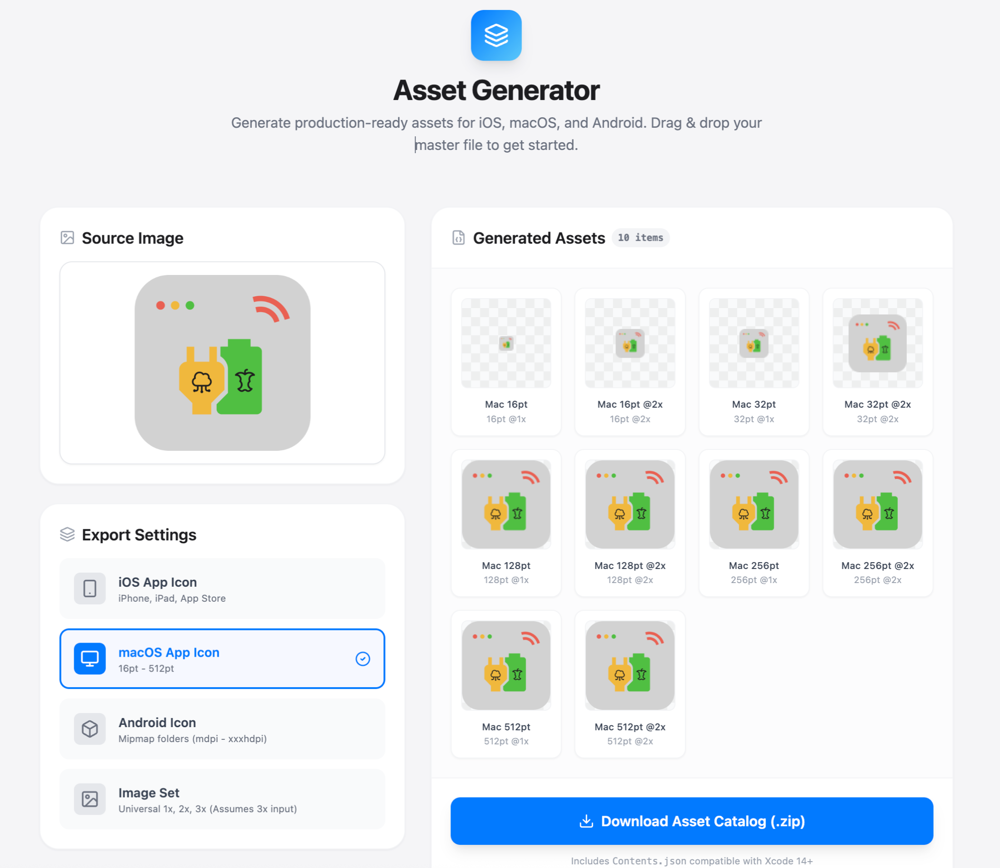
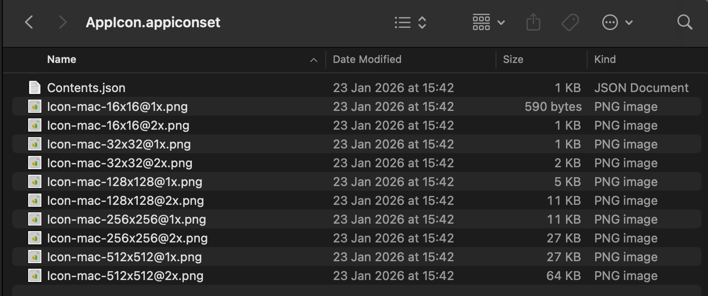

# Asset Generator

A powerful web-based tool to instantly generate production-ready assets for iOS, macOS, and Android from a single master file. Built with React and Vite.




## Features

- **Multi-Platform Support**: Generate assets for:
  - 📱 **iOS App Icons**: Complete set for iPhone, iPad, and App Store.
  - 🖥️ **macOS App Icons**: From 16pt to 512pt.
  - 🤖 **Android Icons**: Standard mipmap folders (mdpi to xxxhdpi).
  - 🖼️ **Universal Image Sets**: Automatically scales 3x images to 2x and 1x.
- **Drag & Drop Interface**: Simple and intuitive UI for uploading your master image.
- **Real-time Preview**: See exactly what your assets will look like before downloading.
- **Xcode Compatible**: Automatically generates `Contents.json` files for iOS and macOS assets, ready to drop into your `Assets.xcassets`.
- **Privacy Focused**: All processing happens locally in your browser. No images are uploaded to any server.

## Usage

1. **Select Platform**: Choose between iOS, macOS, Android, or Image Set tabs.
2. **Upload**: Drag and drop your high-resolution master image (1024x1024 recommended) onto the drop zone.
3. **Review**: Check the generated previews to ensure everything looks correct.
4. **Download**: Click the download button to get a `.zip` file containing your assets.
   - For **iOS/macOS**: Extract and drag the folder into your Xcode `Assets.xcassets`.
   - For **Android**: Copy the `res` folders into your Android project's `src/main/res` directory.

## Tech Stack

- **Framework**: React 19 + TypeScript
- **Build Tool**: Vite
- **Styling**: Tailwind CSS
- **Icons**: Lucide React
- **ZIP Generation**: JSZip
- **File Handling**: FileSaver.js

## Getting Started

### Prerequisites

- Node.js (v18 or higher recommended)
- npm or yarn

### Installation

1. Clone the repository:
   ```bash
   git clone https://github.com/yourusername/asset-generator.git
   cd asset-generator
   ```

2. Install dependencies:
   ```bash
   npm install
   ```

3. Start the development server:
   ```bash
   npm run dev
   ```

4. Open your browser and navigate to `http://localhost:5173`.

## License

MIT
